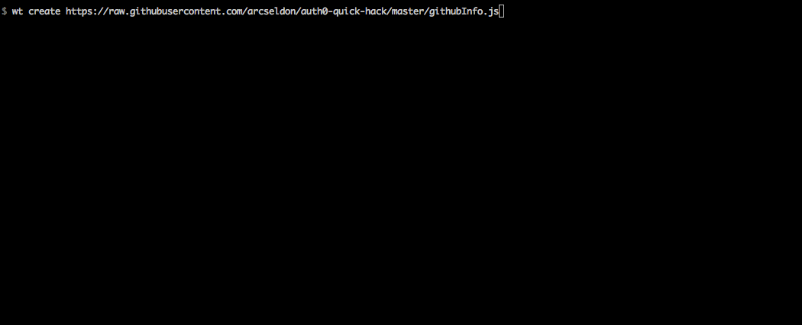

# auth0-quick-hack

Very quick demonstration of [wt-cli](https://www.npmjs.com/package/wt-cli) from [auth0](https://webtask.io).

This app is pretty bare-bones. Does internally use the following popular NPM modules

* async (waterfall)
* lodash
* request

### To run

Install [wt-cli](https://www.npmjs.com/package/wt-cli):

From the root of this repo:

```
> $ wt create githubInfo.js --name github-info
```

You can also reference the published source code:

```
> $ wt create https://raw.githubusercontent.com/arcseldon/auth0-quick-hack/master/githubInfo.js
```

Use that response URL with a username query param suffixed to call the created webtask

#### Example execution

with response URL: https://webtask.it.auth0.com/api/run/wt-arcseldon-gmail_com-0/github-info

With github username: "angular"

```
> $  curl https://webtask.it.auth0.com/api/run/wt-arcseldon-gmail_com-0/github-info?username=angular
```



This app is a quick hack only, there are many limitations etc. However, it is easy to see how this could be extended and potentially used within a web front-end (minus wt-cli). For example a simple Angular app with a search box for username. Then results are presented with the user information and github avatar image, together with a list of matching repos beneath.

Bear in mind that although the Github API is already public, one advantage of using the webtask approach is taking computation offline, and allowing the webtask to provide a custom "aggregated data response" internally having potentially called many different API URLs.
